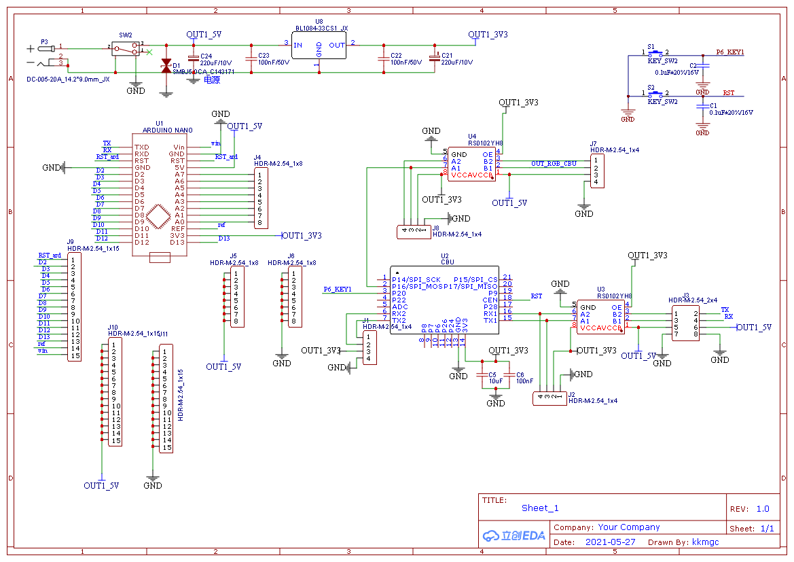
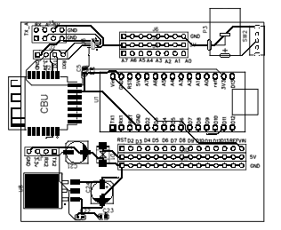

# tuya_arduino_ws2812
This project is developed using Tuya SDK, which enables you to quickly develop branded apps connecting and controlling smart scenarios of many devices.For more information, please check Tuya Developer Website.
## 1、PCB设计
因为手头已经有各种arduino的模块，再加上焊接技术差，所以就把PCB设计成arduino nano的扩展板，再加上涂鸦的CUB模组，把arduino的所有的引脚都引出，做成GVS的3引脚，方便接其他模块。提高后期利用率。因为是个菜鸟，所以PCB的设计的也就那样，是用立创eda编辑的。源文件是仓库里  [立创eda工程源文件涂鸦灯带.zip](立创eda工程源文件涂鸦灯带.zip) 

## 2、硬件模块连接
1. 按钮模块接arduino A0，低电平出发
2. 灯带接arduino A5，我用的是一个16颗ws2812的灯环。
3. 声音传感器接arduino A7，声音传感器要有模拟输出的。

## 3、程序编写

1. 用到两个库，涂鸦的arduino sdk https://github.com/tuya/tuya-wifi-mcu-sdk-arduino-library，还有ws2812的库https://github.com/adafruit/Adafruit_NeoPixel。用arduino 官方的ide开发即可，也可用vs code加插件开发。

2. 涂鸦的iot平台建产品，添加dp点，本程序实现了下面5个dp点的功能。

   DPID_SWITCH_LED	20	开关
   DPID_WORK_MODE	21	模式
   DPID_DREAMLIGHT_SCENE_MODE	51	场景
   DPID_DREAMLIGHTMIC_MUSIC_DATA	52	本地音乐律动
   DPID_MUSIC_DATA	27	app音乐律动

3. 涂鸦智能app除app音乐律动会一直发命令，其他只发送一次，所以将其他dp点的ws2812的灯光变动已到loop（）里面，dp点处理函数只修改状态值。在loop（）里加一个switch（）判断状态值，变动灯光。详细看 [dengdai.ino](dengdai.ino) 

## 4、测试

1. 按按键进入配网，在涂鸦智能app上配网成功。
2. 就可以快乐的玩耍了。本地音乐律动，声音传感器要离声源近点，可能传感器效果太差了。
